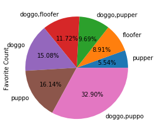

# Mehdi Rahal
# Portfolio

## [Project 1: Communicate Data Findings](https://github.com/Mehdi-Rh/Communicate_Data_Findings)

### Investigation Overview
In this investigation, I wanted to explore when are most trips taken in term of time of day, day of week or month, I also wanted to explore trip duration regarding the same last time features, and see if it is influenced by if a user is a member or a casual customer.

### Dataset

There are 4702822 trip on the dataset with 13 features 
( trip_duration, started_at, ended_at, start_station_id, start_station_name, 
start_lat, start_lng, start_lng, end_station_id, end_station_name, end_lat, 
end_lng, bike_ride_id, member_casual ) 
most variables are object, the trip duration is an 'int' those related to start 
and end position are 'float', the start time and the end time are 'datetime', 
and member_casual wich is a categorical variable.

The data can be found here (https://s3.amazonaws.com/baywheels-data/index.html),
there is a csv for each month, the data gathered was from 06/2019 to 05/2020  
so the the data was concatenated and cleaned by making correct column names, 
droping erronious data (some observations have a negative trip duration), 
set some feature datatypes and finally make a columns for day of time, 
day of week and month of year.

### Summary of Findings

In the exploration, the first notification is that the trip duration followed a normal 
distribution only if we make an exponential transformation, that's why every visualisation 
for trip duration was done with an exponential transformation. After that a distribution 
exploration was done for day of time, time on the week and month on the day.

In a second phase : the relationship between variables has been explored, to explore:

> Periods with the highest number of trips wich are : 

* In term of day of Time : from 08:00 to 10:00 and from 16:00 to 19:00.
* In term of dayof Week : Tuesday, Wednesday ,Thursday and Friday, Monday is slightly 
lower and the weekend have a low total number of trip.
* In term of Months : February 2020 is the with the highest total number. 

> The average trip duration : The average is about 10 minutes, some period of time the 
average is a little high.

* An interesting observation is the negatie relationship between trip duration average 
and the total number of trips for each period of time.

> The influence of the customer type : Casual customers are more susceptible to have 
a long trip, and have a low total number of trips comparing to member customer. 

* This confirms the negative relationship between the trip duration average and the relative 
total number of trips.
  Tools: Python, Pandas, Matplotlib, Seaborn, Jupyter Notebook

## [Project2: Gather, Wrangle and Analyse Data](https://github.com/Mehdi-Rh/Wrangle_Analyse_Data)

This project is an investigation done on a dataset based on data gathered from the twitter API from
WeRateDog page, this is a page that rates people’s dog with a humorous comment about
the dog, the investigation is about finding factors influencing the rating and feedbacks quality.
In this dataset, we have a lot of information, the best information for our investigation was the rating
and the favorite count as feedbacks, and dog breed and dog stage as factors, those two factors are
the most influencing feedbacks. 

  Tools: Python, Pandas, Matplotlib, Jupyter Notebook, Json, Tweepy

## [Project 3: Analyse A/B test results](https://github.com/Mehdi-Rh/Analyse_AB_Test_Results)

A/B tests are very commonly performed by data analysts and data scientists. It is important that you get some practice working with the difficulties of these
In this notebook, an A/B test is runned by an e-commerce website, the goal is to know if the company should implement the new page , keep the old page or run the expriment longer to make their decision

### Datasets

We have two datasets for this project: ab_data and countries
ab_data: comports 294478 rows with 5 features ( user_id, timestamp, group, landing_page, and converted)
countries: user_id, country

### In this notebook the study is done on three parts:

Part I: for statistical exploration
Part II: A/B Test
Part III: A regression approach

### Summary of findings

pval>0.05, zscore<1.64
nb: 1.64 is the critical value for  a=0.05 
conclusion: we fail to reject the nul hypothesis, so the company should keep should keep the old page.

  Tools: Python, Pandas, Matplotlib, Jupyter Notebook

## [Project 4:  Investigate-a-DataSet](https://github.com/Mehdi-Rh/Investigate-a-DataSet)

In this project a dataset named 'Medical Appointment No Shows' is investigated.
 This dataset contains information from 100k medical appointments in Brazil in the 2015 and 2016, the main aspect in this dataset is if a patient show up for its appointment or not.
 The main question in this investigation is : What factors are important for us to know in order to predict if a patient will show up for their scheduled appointment
### Conclusion
According to my investigation there is no way to predict efficiently if a patient will show up or not.
 To answer to the main question wich asks to determine the most important feature to predict if a patient will show up or not:
Except the PatientId and the AppointmentID, each feature can lightly help to do the prediction (but with a very low accuracy)

### Limitation

 The dataset is limited in term of quantity of data, with data of more years the investigation can be more efficient
  Tools: Python, Pandas, Jupyter Notebook

